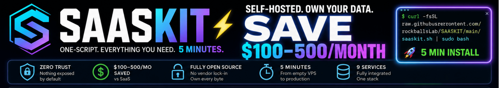
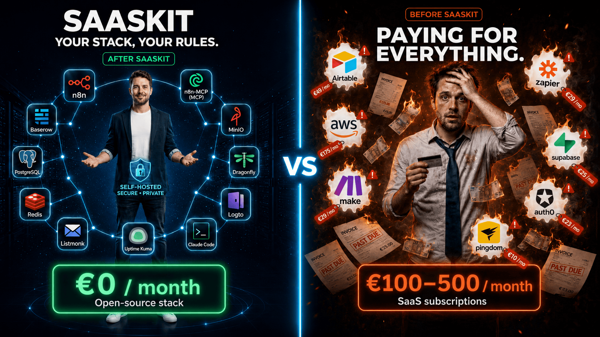
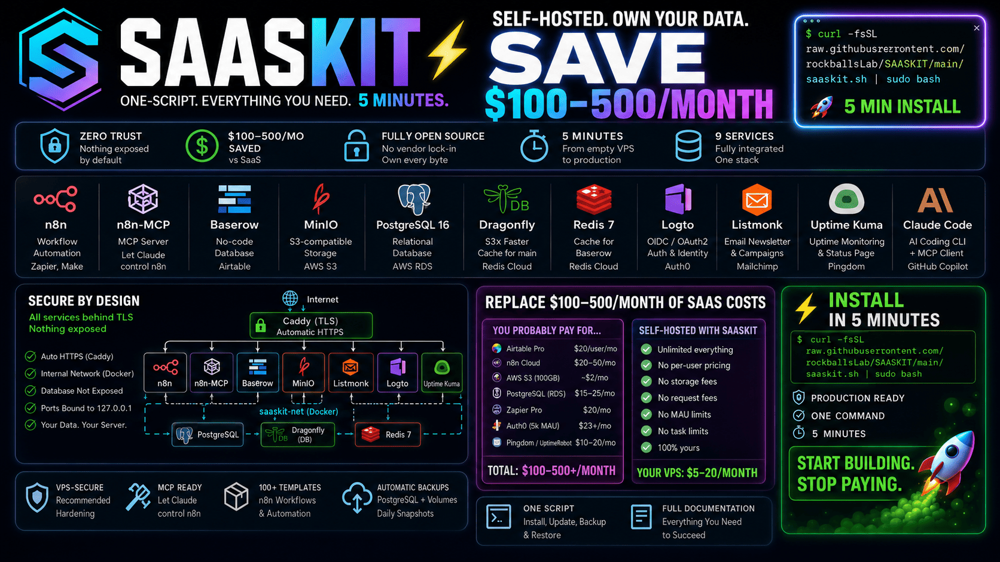

<p align="center">
  
</p>

---


## SAASKIT is a One-script SaaS stack installer for self-hosted indie builders

> n8n · Baserow · MinIO · PostgreSQL · Dragonfly · Logto · Uptime Kuma · Claude Code · MCP


> [!NOTE]
> SAASKIT is the setup I wish I had when I started.
> 
> *(Fabrice - SAAS Founder)*


```bash
# LAUNCH - install SAASKIT (5 min)
curl -fsSL https://raw.githubusercontent.com/rockballslab/SAASKIT/main/saaskit.sh -o saaskit.sh
chmod +x saaskit.sh && sudo ./saaskit.sh install
```


---

<p align="center">
  
</p>

---

## About

👋 Hi, I'm **Fabrice** - a French entrepreneur and serial SaaS builder.

Two years ago, I knew nothing about servers, APIs, or self-hosting. I was paying for a dozen SaaS tools, hitting limits every other week, and had zero control over my own data. Today I run a production stack that costs almost nothing, depends on no one, and I own every byte of it. It took me two years to get here.

**With SAASKIT, it takes you 15 minutes.**

> [!IMPORTANT]
> Instead of spending days reading Docker tutorials, chasing config files, and guessing which security settings actually matter - you get a production-ready, fully wired stack in 15 minutes.
>
> The same stack I use on my own servers, every day, for all my projects.


**My personal stack - tools I build, use, and share:**

| Tool | What it does |
|---|---|
| 🔐 [VPS-SECURE](https://github.com/rockballslab/VPS-SECURE) | VPS hardening - one of the best full security foundation. Install this first. |
| ⚙️ **SAASKIT** | The self-hosted SaaS stack - you're here |
| 🤖 *More coming* | AI agents, autonomous workflows, voice stack |


**Zero Trust philosophy.** Every tool in this ecosystem follows one principle: *nothing is trusted by default, nothing is exposed without a reason*. No port open unless necessary. No service with more access than it needs. Your data stays on your server, under your control - not on someone else's cloud.


---

## Why self-host your SaaS stack?

Because the tools you already pay for every month have a free, production-grade, open-source equivalent - and they're better.

<p align="center">
  
</p>


| You probably pay for... | Self-hosted with SAASKIT | Monthly savings |
|---|---|---|
| **Airtable** Pro ($20/user/mo) | **Baserow** - same no-code UX, unlimited rows, unlimited users | ~$60–200/mo |
| **n8n Cloud** ($20/mo, 5k executions) | **n8n** self-hosted - unlimited executions, unlimited workflows | ~$20–50/mo |
| **AWS S3** (~$25/mo for 100GB + requests) | **MinIO** - S3-compatible, on your VPS, zero storage fees | ~$25/mo |
| **AWS RDS** PostgreSQL (db.t3.micro: ~$15/mo) | **PostgreSQL 16** - shared between all services | ~$15/mo |
| **Zapier** Pro ($49/mo) | Replaced by n8n self-hosted | ~$49/mo |
| **Make** Core ($9/mo) | Replaced by n8n self-hosted | ~$9/mo |
| **Auth0** ($23/mo, 1k MAU) | **Logto** self-hosted - unlimited users, OIDC/OAuth2 | ~$23–200/mo |
| **Pingdom** / **UptimeRobot** paid | **Uptime Kuma** self-hosted - unlimited monitors + public status page | ~$10–50/mo |

> [!IMPORTANT]
> **At current cloud pricing, this stack replaces $100 to $500/month of SaaS costs.** Your VPS costs $5–20/month. The math is obvious.

---

## What you get

| Service | What it does | Open-source alternative to |
|---|---|---|
| **[n8n](https://n8n.io)** | Visual workflow automation - APIs, webhooks, AI agents | Zapier, Make, n8n Cloud |
| **[n8n-MCP](https://github.com/czlonkowski/n8n-mcp)** | MCP server - lets Claude control your n8n workflows | - |
| **[Baserow](https://baserow.io)** | No-code database with a spreadsheet-like UI | Airtable, Monday |
| **[MinIO](https://min.io)** | S3-compatible object storage - files, backups, assets | AWS S3, Cloudflare R2 |
| **[PostgreSQL 16](https://postgresql.org)** | Production-grade relational database, shared by all services | AWS RDS, Supabase |
| **[Dragonfly](https://dragonflydb.io)** | Redis-compatible cache, 25× faster than Redis - dedicated to n8n | Redis Cloud |
| **[Redis 7](https://redis.io)** | Standard Redis cache - dedicated to Baserow | Redis Cloud |
| **[Logto](https://logto.io)** | OIDC/OAuth2 auth - user management, social login, MFA for your SaaS | Auth0, Firebase Auth |
| **[Uptime Kuma](https://uptime.kuma.pet)** | Uptime monitoring + public status page - know before your users do | Pingdom, UptimeRobot |
| **[Claude Code](https://claude.ai/code)** | AI coding CLI, pre-connected to your stack via MCP | GitHub Copilot, Cursor |

**Bonus:** 100+ n8n workflow templates + the n8n-skills Claude Code skillset - cloned locally at install.

---

### Why n8n over Zapier or Make?

> [!TIP]
> **The killer feature of self-hosted n8n: unlimited executions.** Zapier Pro at $49/month gives you 2,000 tasks. n8n self-hosted gives you infinite - for the cost of your VPS.

- **Zapier** charges per *task* (each action in a workflow). A workflow with 5 steps that runs 1,000 times = 5,000 tasks. That's $50/month on the Pro plan.
- **Make** is cheaper but still caps by *operations* (each module execution).
- **n8n self-hosted** runs on your server. 10 million executions? Same cost.

n8n also has a built-in **AI Agent node** - you can wire Claude, GPT-4, or your local Ollama directly into your automations without a separate AI platform.

### Why Baserow over Airtable?

> [!TIP]
> **Airtable's free tier limits you to 1,200 rows per base.** A serious project hits that in a week. Baserow self-hosted has no row limit, no user limit, no base limit.

| Feature | Airtable Free | Airtable Pro ($20/user/mo) | Baserow self-hosted |
|---|---|---|---|
| Rows per base | 1,200 | 50,000 | **Unlimited** |
| Users | 5 | Unlimited | **Unlimited** |
| API access | ✅ | ✅ | ✅ |
| Automations | Limited | ✅ | ✅ |
| Monthly cost | $0 | $20/user | **$0** |
| Your data stays yours | ❌ | ❌ | **✅** |

Baserow uses a standard PostgreSQL backend - your data is in a real database you own and can query directly.

### Why MinIO over AWS S3?

AWS S3 looks cheap per GB ($0.023/GB/month) but the costs add up fast: data transfer OUT at $0.09/GB, PUT/GET requests billed per 1,000 operations - a media-heavy app can easily hit $50–100/month.

MinIO on your VPS: unlimited storage (bound by your disk), bandwidth included in your VPS plan, 100% S3-compatible API.

> [!NOTE]
> Your existing AWS S3 code works with MinIO without modification. Change the endpoint URL and credentials in your `.env`. That's it.

### Why Logto over Auth0?

Auth0 free tier caps at 7,500 MAU. After that, $23/month minimum - and it scales fast with users. Firebase Auth locks you into Google's ecosystem. Cognito charges per MAU.

Logto self-hosted: unlimited users, unlimited apps, full OIDC/OAuth2 compliance, social login (Google, GitHub, etc.), MFA, and a clean admin UI - all on your VPS.

> [!NOTE]
> Logto is pre-wired to the shared PostgreSQL instance. Zero extra database to manage.

### Why Uptime Kuma over Pingdom?

Pingdom starts at $10/month for 10 monitors. UptimeRobot free tier limits check intervals to 5 minutes and caps monitors. Statuspage.io for a public status page is another $29/month.

Uptime Kuma self-hosted: unlimited monitors, 60-second check intervals, Telegram/email/webhook alerts, and a public status page at `https://status.yourdomain.com` - all included, zero extra cost.

---


## Quick start

```bash
# Step 1 - harden your VPS first (15 min)
curl -fsSL https://raw.githubusercontent.com/rockballslab/VPS-SECURE/main/install-secure.sh -o install-secure.sh
chmod +x install-secure.sh && sudo ./install-secure.sh
```

```bash
# Step 2 - install SAASKIT (5 min)
curl -fsSL https://raw.githubusercontent.com/rockballslab/SAASKIT/main/saaskit.sh -o saaskit.sh
chmod +x saaskit.sh && sudo ./saaskit.sh install
```

> [!TIP]
> We strongly recommend installing vps-secure first. It hardens your server (firewall, SSH, Docker isolation) in 15 minutes - and makes everything below production-safe. SAASKIT works without it, but you'd be running exposed services on an unhardened VPS.

---


## Prerequisites

> [!TIP]
> **Running on a fresh VPS?** We recommend installing [vps-secure](https://github.com/rockballslab/vps-secure) first. It sets up your firewall, SSH hardening, and Docker isolation in 15 minutes - and makes SAASKIT significantly more secure. Skip it if you already have a hardened server.

### Server requirements

| Requirement | Minimum | Recommended |
|---|---|---|
| OS | Ubuntu 24.04 LTS | Ubuntu 24.04 LTS |
| RAM | 8 GB | **16 GB** |
| Disk | 20 GB | 50 GB+ |
| CPU | 2 vCPU | 4 vCPU |

> [!NOTE]
> Tested on Hostinger KVM2 (16GB RAM, 8 vCPU, 200GB NVMe). Total install time: ~8 minutes.


### DNS records (required before install)

Point all subdomains to your VPS IP **before** running the script. The installer checks DNS and warns you if records are missing.

```
n8n.<yourdomain.com>            → YOUR_VPS_IP
mcpn8n.<yourdomain.com>         → YOUR_VPS_IP
baserow.<yourdomain.com>        → YOUR_VPS_IP
minio.<yourdomain.com>          → YOUR_VPS_IP
minio-console.<yourdomain.com>  → YOUR_VPS_IP
listmonk.<yourdomain.com>       → YOUR_VPS_IP
auth.<yourdomain.com>           → YOUR_VPS_IP
status.<yourdomain.com>         → YOUR_VPS_IP
```

> [!TIP]
> DNS propagation takes 0–48 hours depending on your registrar. Most modern registrars (Cloudflare, Namecheap) propagate within 1–5 minutes.

---

## Install

The script is **fully interactive** and guides you at every step:

```
  Domain root (ex: mydomain.com)                          :
  Admin email                                             :
```

Listmonk, Logto and Uptime Kuma are installed automatically - no prompt needed. Everything else is generated automatically - database passwords, encryption keys, MCP authentication token. All credentials are saved to `/etc/vps-secure/saas-kit.conf` (readable only by root).

### What the script does - step by step

```
[1/9] Prerequisites    - detects Docker, reverse proxy mode (inject or standalone)
[2/9] Configuration    - prompts for domain + email, generates all secrets
[3/9] DNS check        - verifies all subdomains resolve to this VPS
[4/9] Environment      - creates /opt/saas-kit/, .env (chmod 600), init SQL (4 databases)
[5/9] docker-compose   - generates compose file with pinned image versions
[6/9] Reverse proxy    - injects Caddy blocks (or creates standalone Caddyfile)
[7/9] Containers       - pulls images, starts services in dependency order
[8/9] n8n templates    - clones 100+ workflow templates + n8n-skills locally
[9/9] Claude Code CLI  - installs Node.js + @anthropic-ai/claude-code globally
```

> [!NOTE]
> **Reverse proxy detection is automatic.** If VPS-SECURE is installed, SAASKIT injects its routes into the existing Caddy instance - no port conflict. If no proxy is found, a standalone Caddy is created. You don't need to configure anything.

> [!WARNING]
> If a previous installation is detected (`.env` exists), the script stops and asks you to run `update` or `uninstall` first. **It will not silently overwrite an existing installation.**

---

## Post-install (required steps)

### Step 1 - Create your Baserow admin account

Baserow does not auto-create accounts on first run. Open `https://baserow.<domain>` and register with your admin email.

### Step 2 - Create your Logto admin account

Logto does not auto-create accounts on first run. Access the admin console locally on your VPS:

```bash
ssh -L 3002:127.0.0.1:3002 vpsadmin@<your-vps-ip> -p 2222
```

Then open `http://localhost:3002` in your browser and create your admin account. The Logto OIDC endpoint is publicly accessible at `https://auth.<domain>`.

### Step 3 - Configure Listmonk

Open `https://listmonk.<domain>/install` and complete the initial setup (admin account + SMTP configuration).

### Step 4 - Set up Uptime Kuma

Open `https://status.<domain>` and create your admin account. Then add monitors for each service - n8n, Baserow, Logto, MinIO. Your users can check `https://status.<domain>` at any time to see the real-time status of your SaaS.

### Step 5 - Verify all services

```bash
sudo ./saaskit.sh keys    # displays all URLs and credentials
```

> [!TIP]
> Bookmark `https://n8n.<domain>`, `https://baserow.<domain>`, `https://auth.<domain>`, `https://status.<domain>`, and `https://minio-console.<domain>` immediately after install. Your credentials are in `/etc/vps-secure/saas-kit.conf`.

---

## MCP - Let Claude control your stack

**MCP (Model Context Protocol)** is an open standard by Anthropic that lets AI models connect to external tools and services - like a universal plug for AI.

SAASKIT ships with **n8n-MCP** pre-configured: your n8n instance exposes an MCP server that Claude can use to read, create, and trigger workflows directly - no copy-pasting JSON, no manual API calls.

> [!NOTE]
> Think of MCP as giving Claude a keyboard and mouse on your n8n. You describe what you want in plain English. Claude builds and deploys it.

### What you can do with Claude + n8n via MCP

- *"Create a workflow that sends me a Telegram alert when a new row is added to Baserow"*
- *"List all my active workflows and tell me which ones haven't run in 7 days"*
- *"Build a lead capture workflow: webhook → Baserow → email notification"*
- *"Trigger my backup workflow now"*

Claude writes, deploys, and can trigger your n8n workflows - from Claude Desktop, Claude.ai, or Claude Code CLI.

### Step 1 - Enable n8n API

In your n8n instance: **Settings → n8n API → Create an API key**

Then run on your VPS:

```bash
sudo saaskit-mcp-apikey.sh <your-n8n-api-key>
```

This wires the API key into the n8n-MCP container and restarts it automatically.

### Step 2 - Connect Claude Desktop

Add this block to your `claude_desktop_config.json`:

- **macOS:** `~/Library/Application Support/Claude/claude_desktop_config.json`
- **Windows:** `%APPDATA%\Claude\claude_desktop_config.json`

```json
{
  "mcpServers": {
    "n8n": {
      "command": "npx",
      "args": ["n8n-mcp"],
      "env": {
        "MCP_MODE": "http",
        "MCP_SERVER_URL": "https://mcpn8n.<yourdomain.com>",
        "AUTH_TOKEN": "<your-mcp-token>",
        "LOG_LEVEL": "error"
      }
    }
  }
}
```

Your MCP token is in `/etc/vps-secure/saas-kit.conf` → `MCP_TOKEN`.

Restart Claude Desktop. You'll see **n8n** appear in the MCP tools list (🔨 hammer icon).

### Step 3 - Connect Claude Code CLI (on your VPS)

Claude Code is installed by SAASKIT and pre-configured to talk to your stack. From your VPS:

```bash
claude   # opens Claude Code CLI
```

Claude Code auto-loads the skill at `/opt/saas-kit/templates/n8n-skills/SKILL.md`, which gives it your connection strings, PostgreSQL access patterns, and n8n best practices.

> [!TIP]
> Claude Code + n8n-MCP on the same machine = your most powerful setup. Ask Claude to write a workflow, deploy it via MCP, then verify the result in Baserow - all in one conversation.

### Compatible MCP clients

n8n-MCP uses the standard HTTP+SSE transport. Any MCP-compatible client works:

| Client | Config needed |
|---|---|
| **Claude Desktop** | See Step 2 above |
| **Claude Code CLI** | Pre-configured at install |
| **Cursor** | Same JSON config as Claude Desktop |
| **Windsurf** | Same JSON config as Claude Desktop |
| **Custom agent** | `MCP_SERVER_URL` + `AUTH_TOKEN` headers |


---

## Architecture

```
                       Internet
                          │
                   [Caddy / TLS]
              (vps-monitor-caddy or saaskit-caddy)
                          │
         ┌────────────────┼──────────────────────────┐
         │                │          │       │        │
  127.0.0.1:5678   127.0.0.1:5680  :5682   :3001    :5684
         │                │          │       │        │
    saaskit-n8n    saaskit-baserow  listmonk logto  uptime-kuma
         │
  127.0.0.1:5679   127.0.0.1:9000/9001
         │                │
   saaskit-n8n-mcp   saaskit-minio
         │
         └──────────── saaskit-net (Docker bridge) ───┐
                         │              │             │           
                  saaskit-postgres  dragonfly      redis   
```

All SAASKIT containers communicate on `saaskit-net`. All public services are bound to `127.0.0.1` and proxied through Caddy with automatic HTTPS. The Logto admin console (port 3002) is local-only - never exposed publicly.

---

## Commands

```bash
sudo ./saaskit.sh install             # install the full stack
sudo ./saaskit.sh keys                # display all URLs and credentials
sudo ./saaskit.sh backup              # full backup (PostgreSQL + volumes → MinIO)
sudo ./saaskit.sh backup --postgres   # PostgreSQL only
sudo ./saaskit.sh backup --volumes    # volumes only
sudo ./saaskit.sh backup --list       # list local backups
sudo ./saaskit.sh update              # update all Docker images
sudo ./saaskit.sh update n8n          # update a single service
sudo ./saaskit.sh update --check      # check available updates (dry run)
sudo ./saaskit.sh uninstall           # clean uninstall (asks confirmation)
```

### Docker commands

```bash
cd /opt/saas-kit

docker compose ps                                                # container status
docker compose logs -f n8n                                       # live logs for n8n
docker compose logs -f baserow                                   # live logs for Baserow
docker compose logs -f logto                                     # live logs for Logto
docker compose logs -f listmonk                                  # live logs for Listmonk
docker compose logs -f uptime-kuma                               # live logs for Uptime Kuma
docker compose restart n8n                                       # restart a service
docker compose down && docker compose --env-file .env up -d     # full restart
```

---

## Backup

`saaskit.sh backup` does two things:

1. **PostgreSQL dump** - all databases (`n8n_db`, `baserow_db`, `listmonk_db`, `logto_db`), compressed with gzip
2. **Volume backup** - n8n workflows + credentials, MinIO data, Uptime Kuma monitors + history

Backups are stored in `/opt/saas-kit/backups/` and automatically uploaded to your MinIO internal bucket.

### External backup (optional but recommended)

For off-VPS backup (Backblaze B2, Hetzner S3, etc.), create `/opt/saas-kit/backup-external.conf`:

```bash
BACKUP_EXTERNAL_ENDPOINT="https://s3.us-west-004.backblazeb2.com"
BACKUP_EXTERNAL_ACCESS_KEY="your-access-key"
BACKUP_EXTERNAL_SECRET_KEY="your-secret-key"
BACKUP_EXTERNAL_BUCKET="my-saaskit-backups"
```

> [!IMPORTANT]
> Backups older than 7 days are automatically deleted from `/opt/saas-kit/backups/`. Configure an external destination if you need longer retention.

---

## n8n workflow templates

After install, two template collections are available locally:

```
/opt/saas-kit/templates/awesome-n8n-templates/   # 100+ ready-to-import workflows
/opt/saas-kit/templates/n8n-skills/              # Claude Code skillset for n8n
```

**Import a workflow:** n8n UI → New workflow → ⋮ menu → Import from file → pick any `.json`.

**Use n8n-skills with Claude Code:**

```bash
cat /opt/saas-kit/templates/n8n-skills/SKILL.md
```

---

## Claude Code integration

This repo includes a `CLAUDE.md` (auto-loaded by Claude Code) and a skill at `.claude/skills/SAASKIT-stack/SKILL.md`.

The skill auto-triggers when Claude Code is working in this project and provides:

- Connection strings for all services
- PostgreSQL and MinIO quick commands
- Credential reading patterns
- Known gotchas (Dragonfly/Lua compatibility, n8n UID 1000, MinIO path-style S3...)

---

## Ports reference

| Service | Host binding | Port | Notes |
|---|---|---|---|
| n8n | 127.0.0.1 | 5678 | Proxied by Caddy |
| n8n-MCP | 127.0.0.1 | 5679 | Proxied by Caddy |
| Baserow | 127.0.0.1 | 5680 | Proxied by Caddy |
| MinIO API | 127.0.0.1 | 9000 | S3-compatible endpoint |
| MinIO Console | 127.0.0.1 | 9001 | Admin UI |
| Logto (OIDC) | 127.0.0.1 | 3001 | Proxied by Caddy |
| Logto (admin) | 127.0.0.1 | 3002 | Local only - access via SSH tunnel |
| Uptime Kuma | 127.0.0.1 | 5684 | Proxied by Caddy - status page public |
| PostgreSQL | internal only | 5432 | Not exposed externally |
| Dragonfly | internal only | 6379 | n8n cache - not exposed |
| Redis | internal only | 6379 | Baserow cache - not exposed |

> [!WARNING]
> No service is bound to `0.0.0.0`. Everything is either internal (`saaskit-net`) or bound to `127.0.0.1` and proxied through Caddy with TLS. **Never manually expose PostgreSQL, Dragonfly, Redis, or the Logto admin port on a public port.**

---


## Built with

- [VPS-SECURE](https://github.com/rockballslab/VPS-SECURE) - VPS hardening baseline (strongly recommended)
- [n8n](https://n8n.io) - workflow automation platform
- [n8n-mcp](https://github.com/czlonkowski/n8n-mcp) - MCP server for n8n by @czlonkowski
- [Baserow](https://baserow.io) - open-source no-code database
- [MinIO](https://min.io) - S3-compatible object storage
- [PostgreSQL](https://postgresql.org) - relational database
- [DragonflyDB](https://dragonflydb.io) - Redis-compatible in-memory store
- [Logto](https://logto.io) - open-source OIDC/OAuth2 auth & identity
- [Uptime Kuma](https://uptime.kuma.pet) - self-hosted uptime monitoring & status pages
- [Caddy](https://caddyserver.com) - automatic HTTPS reverse proxy
- [awesome-n8n-templates](https://github.com/enescingoz/awesome-n8n-templates) - community workflow templates
- [n8n-skills](https://github.com/czlonkowski/n8n-skills) - Claude Code skillset for n8n

---

## License

MIT - use it, fork it, build on it.

---

*by [rockballslab](https://github.com/rockballslab)*
